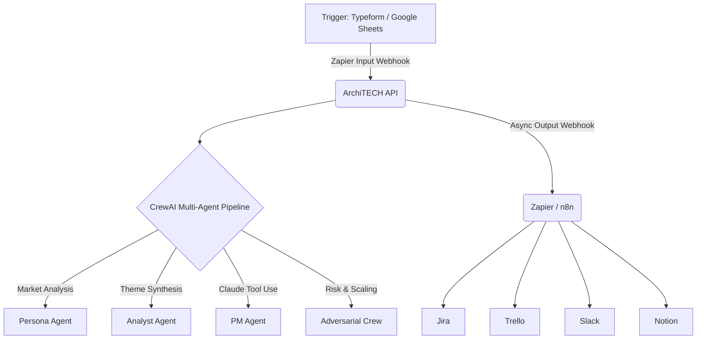

# ArchiTECH — AI Product Planner

> Turn a one-sentence product idea into a fully-populated, risk-adjusted backlog in under 60 seconds across Jira, Trello, Slack, and Notion.


## The Problem

Product Managers spend countless hours turning high-level business ideas into granular, developer-ready backlogs. Brainstorming edge cases, formatting user stories, adding acceptance criteria, and syncing it all to Jira or Trello is a massive operational bottleneck. 

## The Solution

ArchiTECH acts as an "Agentic AI Brain" in your existing business workflows. It automates the entire backlog creation process.




## Results & Metrics

- Generates 15–20 risk-adjusted user stories per idea in ~45 seconds.
- Reduces PM backlog-creation time from ~4 hours to under 1 minute.
- Supports unlimited output destinations (Jira, Trello, Notion, Slack) via a single Zapier/n8n webhook without code changes.

## Architecture Deep-Dive

ArchiTECH is built on a modern Python backend using a robust queue architecture:
- **FastAPI** handles incoming webhook triggers.
- **Celery + Redis** queue long-running AI simulation tasks asynchronously.
- **CrewAI** orchestrates the "Customer Crew" and "Adversarial Crew" to brainstorm and stress-test themes.
- **Claude Tool Use (Anthropic API)** handles the deterministic extraction of structured backlog JSON.
- **Zapier / n8n Endpoints** provide universal inputs and outputs to stitch the AI brain into enterprise workflows.

## CV Summary

**ArchiTECH — AI Product Planner (Personal Project, 2025)**
Built an agentic AI system using Claude that converts product ideas into developer-ready backlogs across Trello, Jira, Notion, and Slack via Zapier webhooks and exportable n8n workflows. Designed multi-agent pipeline (CrewAI + Claude tool use), FastAPI backend, PostgreSQL/pgvector data layer. Includes custom Claude Code commands for scaffolding new integrations.
*Tech: Python, FastAPI, Claude API, CrewAI, Zapier, n8n, PostgreSQL, Celery, Redis*

## My Role

This was initially a hackathon project where I led the backend and overall system architecture. I have since migrated the LLM infrastructure to Claude, integrated the tool-calling logic explicitly, and built out the Zapier and n8n export endpoints to transition it from a toy app to a realistic business integration.

## What I Learned

- **Multi-agent AI orchestration** with CrewAI and Anthropic's Claude.
- **Explicit Claude Tool Use** for deterministic structured outputs.
- **Webhooks & Workflow Automation** by building native integrations for Zapier and n8n.
- **Asynchronous Task Queues** using Celery and Redis to handle LLM delays without blocking the API.

---

## Run Locally

```bash
# Clone the repo
git clone https://github.com/noobbatman/architech-ai-product-planner
cd architech-ai-product-planner/architech_backend

# Configure environment
cp .env.example .env
# Add your keys: ANTHROPIC_API_KEY, APP_API_KEY

# Start the entire stack (FastAPI, Celery, Redis, PostgreSQL)
docker-compose up -d
```

API docs: http://localhost:8000/docs
Zapier Setup: [View ZAPIER_INTEGRATION.md](docs/ZAPIER_INTEGRATION.md)
